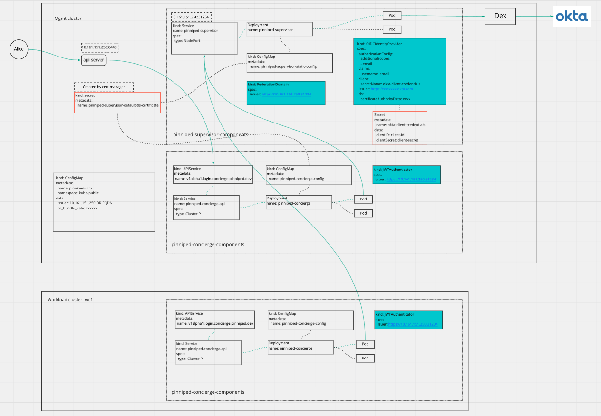

# Pinniped integration for TKG

## Introduction

The goal of integrating with Pinniped is to provide user authentication feature for TKG clusters. Pinniped allows cluster
administrators to easily plug in external identity providers (IDPs) into Kubernetes clusters. This is achieved via a
uniform install procedure across all types and origins of Kubernetes clusters, declarative configuration via Kubernetes
APIs, enterprise-grade integrations with IDPs, and distribution-specific integration strategies. Users could specify the
identity management source(OIDC/LDAP) during the cluster bootstrapping step and perform Day2 configurations based on
their needs.

[Official Pinniped documentation](https://pinniped.dev/docs/)

## Architecture

### Components on Management cluster

- Pinniped Supervisor
- Pinniped Concierge
- Dex
- Pinniped post deployment job

There are three CRs of Pinniped will be deployed:

- OIDCIdentityProvider
- FederationDomain
- JWTAuthenticator

And there is a ConfigMap called `pinniped-info` created under `kube-public` with cluster_name, issuer,
issuer_ca_bundle_data as its content.

#### Why having Dex deployed as part of Pinniped

Having Dex deployed as part of Pinniped is to support LDAP use cases since current release of Pinniped(v0.4.0) does not
have LDAP supported. Per design for TKG Calgary release, we actually use Dex for both OIDC and LDAP by configuring the 
upstream identity provider of Pinniped to always be Dex and the static client of Dex always be Pinniped. We have the plan
to improve this flow by using Dex only for LDAP, and this will land post TKG Calgary release.

#### Why having Pinniped post deployment job

There are something we could not configure at the time of the deployment, e.g. service external IP/DNS for both Pinniped
and Dex. We need the post deployment job to configure those things to make the entire authentication work. It configures
the following:
- Update `Certificate` to have correct external IP/DNS for both Dex and Pinniped service.
- Update `OIDCIdentityProvider` to have correct issuer url and tls cert.
- Update `JWTAuthenticator` to have correct issuer url.
- Update `ConfigMap` of Dex to have correct configurations.
- Update `Secret` used by the communication between Dex and Pinniped.

There will be a new implementation of the post deployment job which will configure the `Pinniped Addon Secret` directly
instead of updating the K8S resources, so that the Addon-Manager will picks up the change and reconcile.

### Components on Workload clusters

- Pinniped Concierge

There are one CRs of Pinniped will be deployed:

- JWTAuthenticator

The JWTAuthenticator holds the issuer url pointing back to Pinniped Supervisor service, so that the workload cluster could
communicate back to management cluster to complete the whole authentication flow.

## How to enable TKG Pinniped addon at the cluster bootstrapping step

If you use TKG cli or Tanzu cli to bootstrap TKG clusters, then the installation wizard will guide you to fill in the required
configurations in order to deploy TKG Pinniped addon.

## How to enable TKG Pinniped addon to an existing cluster

**Note:** You could use this approach to deploy TKG Pinniped addon to any clusters, there is no need to install addon-manager
or kapp-controller to test out TKG Pinniped addon.  

- Create the ytt value yaml(`values.yaml`) based on the example from [here](./examples), and substitute the values for
  your case.
- Run `ytt --ignore-unknown-comments -f ../ytt-common-libs -f ../pinniped/templates -f values.yaml > pinniped.yaml`
- Run `kubectl apply -f pinniped.yaml`. Once you have applied the `pinniped.yaml` you should be able to see required 
  resources are creating. The post deploy job 
  will also be running to configure the Pinniped and Dex installation to make all things work. Wait for a while until
  the post deploy job to complete.
  - If using external OIDC provider, you might want to configure the OIDC provider by providing correct login redirect
    url to Dex service.
- Copy the Pinniped-cli from [here](./post-deploy/hack/bin/pinniped-cli) or download from Pinniped [Github](https://github.com/vmware-tanzu/pinniped/releases)
- Run `./pinniped-cli get kubeconfig` to get the updated kubeconfig which could be distributed to authorized users. The 
  users with that kubeconfig will be redirected to configured authentication page.
  
## Images

### Post deploy job images

- Latest development image: gcr.io/kubernetes-development-244305/gdaniel/tkg-pinniped-post-deploy:latest

### Pinniped addon template images

- Latest development image: gcr.io/kubernetes-development-244305/gdaniel/tkg-addons-pinniped-templates:latest

## Known issues and debug guidelines

- The OIDC discovery failure from OIDCIdentityProvider
  - Check the issuer to make sure it is pointing to the IDP configured
  - Check if the TLS certificate is correct, the TLS certificate is the one used to talk to upstream IDP
  - The OIDCIdentityProvider should be configured automatically by the post deployment job, if it is not configured properly
    check the log of post deployment job to see there are any errors
  